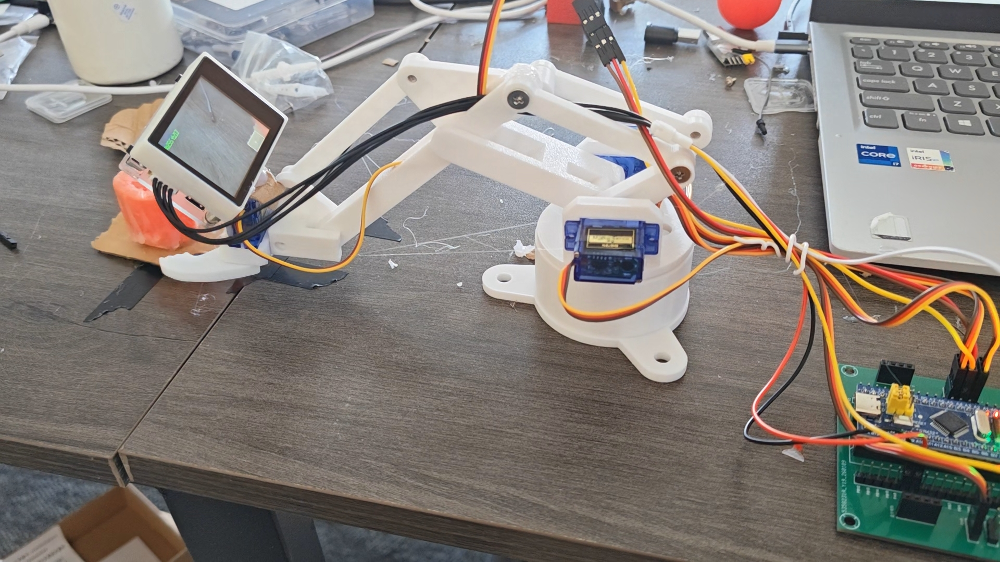

# 智能硬件产品展示网站

## 项目结构

```
product-showcase/
├── index.html                    # 首页（Hero + 产品卡片 + 全部项目）
├── product-gesture-arm.html      # GesturePilot 体感操控机械臂详情页
├── product-sound-core.html       # SoundCore 嵌入式音频终端详情页
├── product-vision-tracker.html   # VisionTracker 智能视觉追踪臂详情页
├── css/
│   └── styles.css                # 全部样式（分段注释，便于维护）
├── js/
│   └── main.js                   # 全部交互脚本（模块化注释）
├── images/                       # 产品图片目录（待上传）
│   └── .gitkeep
└── README.md                     # 本文件
```

## 图片命名规范

将图片放入 `images/` 目录，按以下命名约定命名：

### 首页 Hero 区域
| 文件名 | 建议尺寸 | 说明 |
|--------|----------|------|
| `hero-main.jpg` | 760×900 | 首屏右侧主卡片 |
| `hero-sub1.jpg` | 400×520 | 首屏右侧副卡片1 |
| `hero-sub2.jpg` | 400×400 | 首屏右侧副卡片2 |

### 首页产品卡片缩略图
| 文件名 | 建议尺寸 | 说明 |
|--------|----------|------|
| `gesture-arm-thumb.jpg` | 800×560 | 体感操控机械臂卡片 |
| `sound-core-thumb.jpg` | 800×560 | 嵌入式音频终端卡片 |
| `vision-tracker-thumb.jpg` | 800×560 | 智能视觉追踪臂卡片 |

### 产品详情页画廊（每个产品3张）
| 文件名 | 建议尺寸 | 说明 |
|--------|----------|------|
| `gesture-arm-main.jpg` | 800×600 | 机械臂主图（画廊大图） |
| `gesture-arm-glove.jpg` | 400×300 | 体感手套特写 |
| `gesture-arm-board.jpg` | 400×300 | 控制板细节 |
| `sound-core-main.jpg` | 800×600 | 音频终端主图 |
| `sound-core-lcd.jpg` | 400×300 | LCD界面展示 |
| `sound-core-board.jpg` | 400×300 | 开发板与VS1053模块 |
| `vision-tracker-main.jpg` | 800×600 | 视觉追踪臂主图 |
| `vision-tracker-camera.jpg` | 400×300 | K210摄像头模块 |
| `vision-tracker-tracking.jpg` | 400×300 | PID追踪效果演示 |

## 如何替换图片

所有图片占位符已在 HTML 中用注释标记，只需：

1. 将图片放入 `images/` 目录，按上表命名
2. 在对应 HTML 文件中搜索图片文件名，取消注释 `` 标签
3. 删除对应的 `<div class="placeholder">` 或 `<div class="gallery-placeholder">` 块

### 示例：替换体感机械臂缩略图

**替换前 (index.html):**
```html
<div class="placeholder">
  <svg>...</svg>
  <span>产品图片待上传</span>
</div>
<!--  -->
```

**替换后:**
```html

```

## 如何添加新项目卡片

在 `index.html` 的 `全部项目总览` 区域，复制一个 `mini-card` 块并修改标题：

```html
<div class="mini-card reveal">
  <div class="mini-card-icon">
    <svg><!-- 选择合适的图标 --></svg>
  </div>
  <div class="mini-card-title">新项目名称</div>
</div>
```

## 技术栈

- **纯 HTML/CSS/JS**，无框架依赖，任何静态服务器即可部署
- CSS 变量集中管理颜色、间距、圆角等设计令牌
- Intersection Observer API 实现滚动显现动画
- 响应式设计支持桌面、平板、手机
- 多页面结构，每个产品独立页面，便于维护和扩展
